# Ontologie
L'ontologia core è l'ontologia MLPS sul fascicolo sociale e lavorativo del lavoratore.
Per l'ontologia si utilizzano directory versionate.
Le ontologie sono pubblicate in formato RDF/Turtle (media type text/turtle) e l'estensione del file è .ttl.

Diagrammi Ontologia Core:

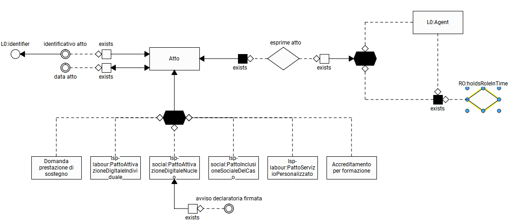
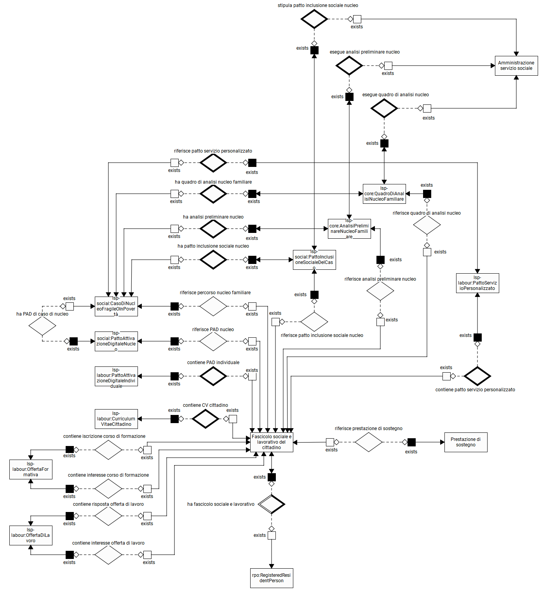
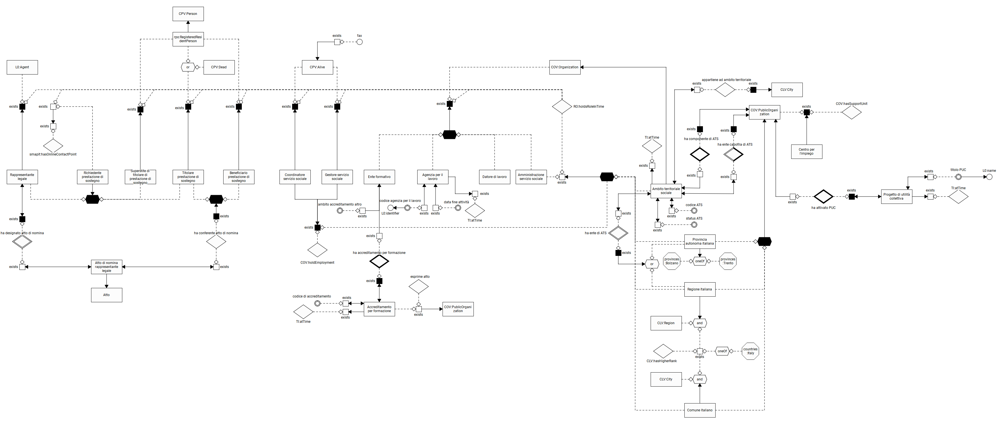
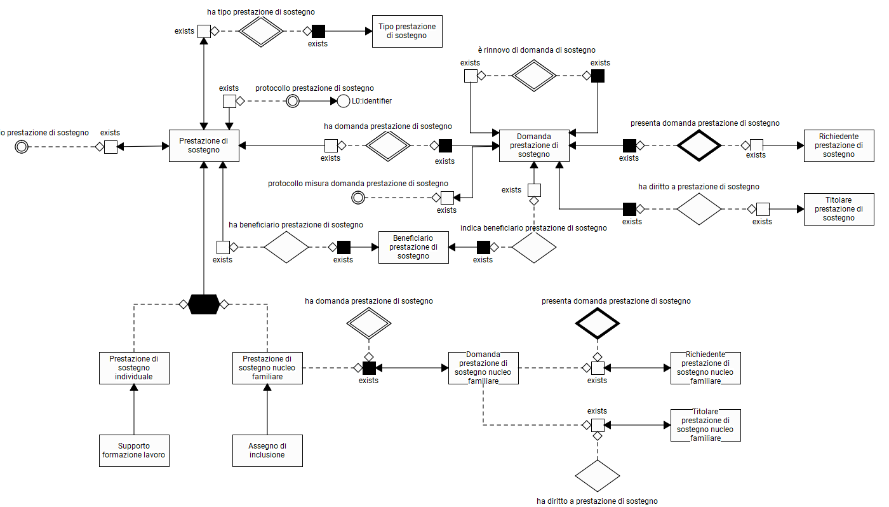

Diagrammi Ontologia SIISL:

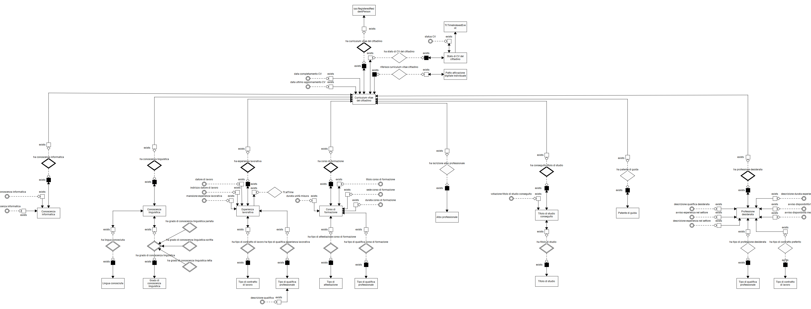
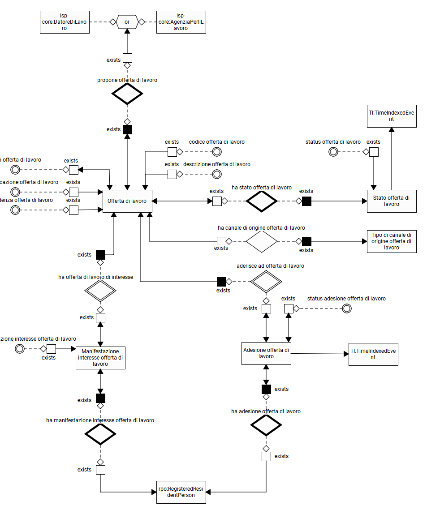
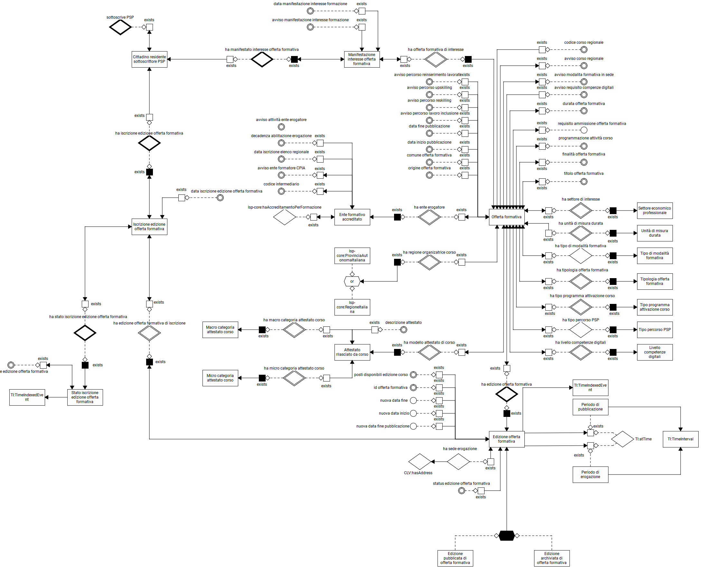
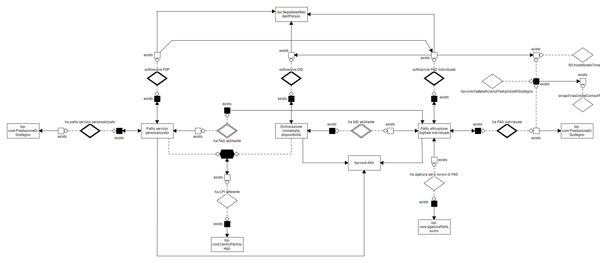

Diagrammi Ontologia Social-GePI:

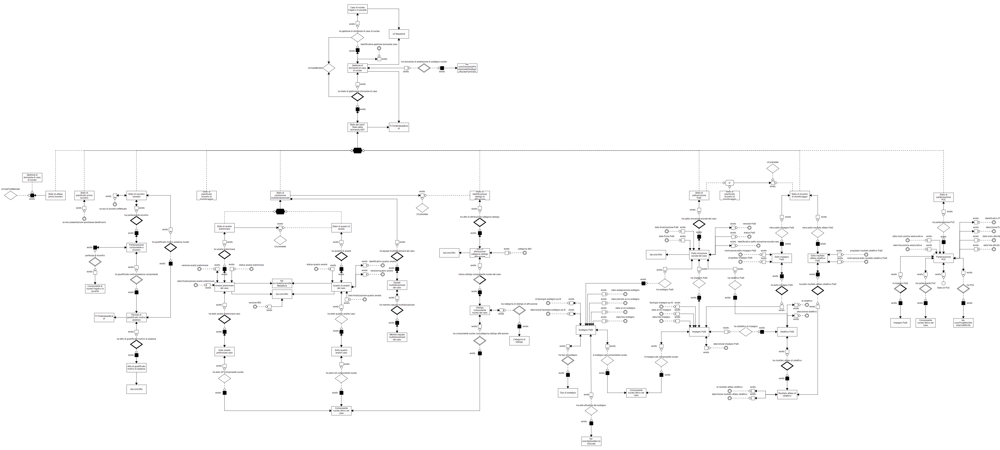
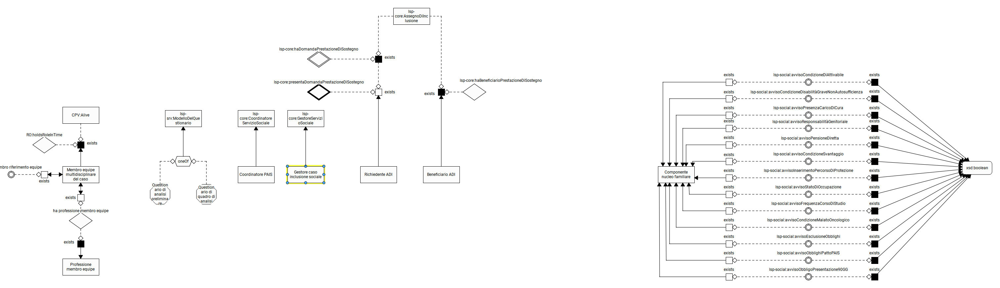
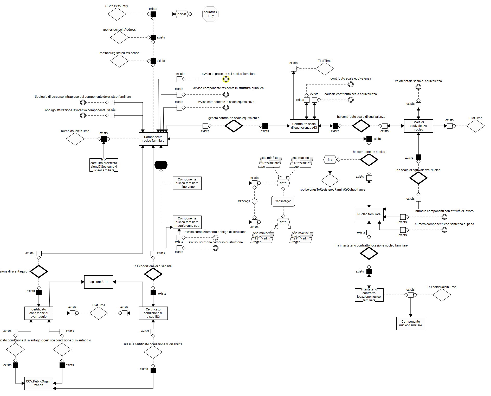
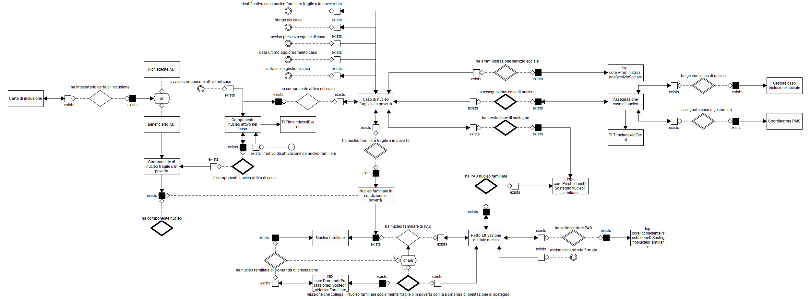

Diagrammi Ontologia Survey-GePI:

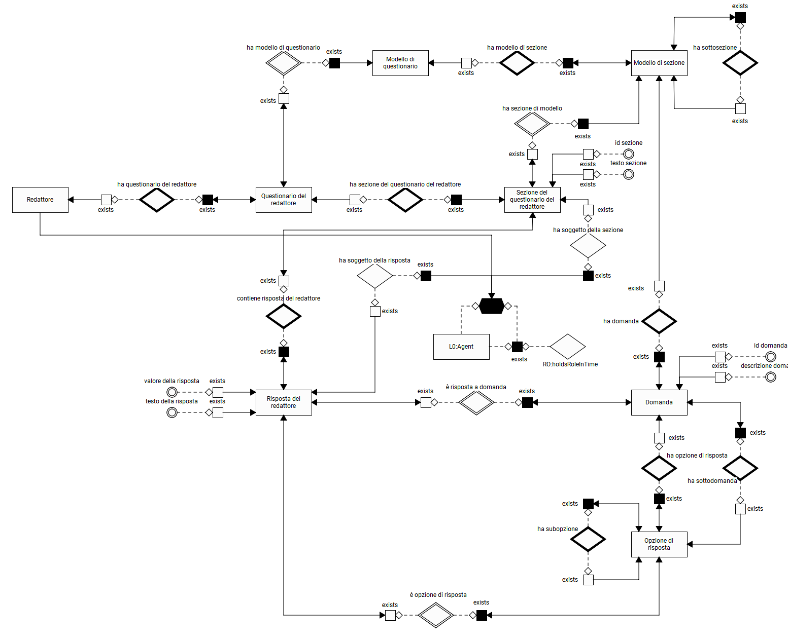